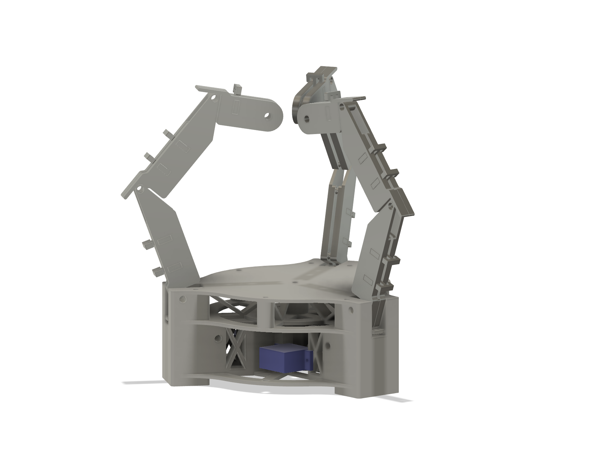
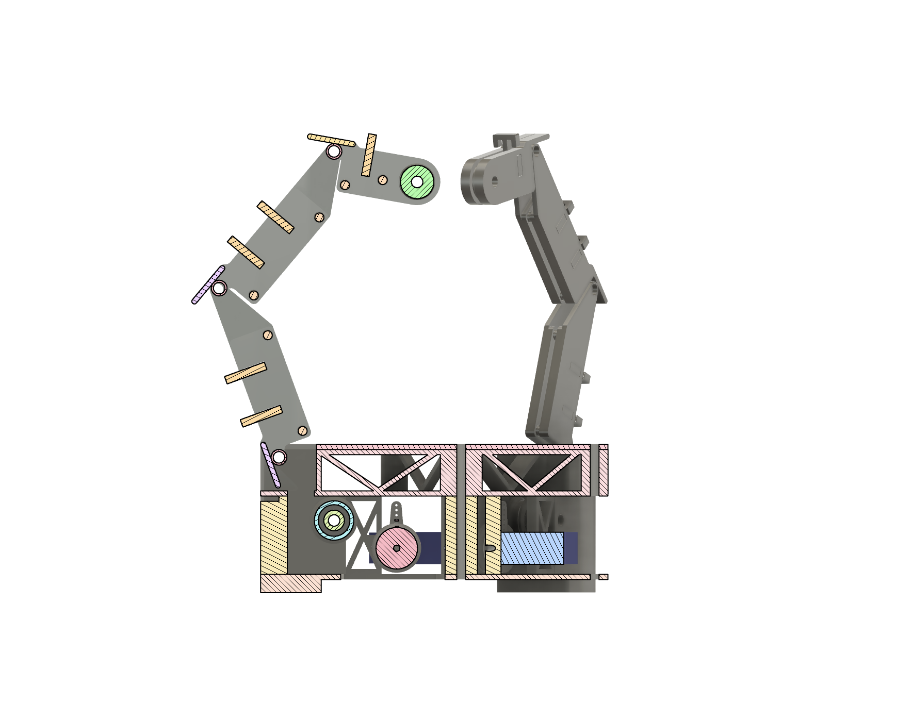

# EMG Tendon-Driven Gripper

Tendon-driven robotic gripper prototype with servo-based actuation, designed for future EMG integration.

---

## System Overview

*Figure 1 – Current servo-based gripper assembly.*

*Figure 2 – Section view highlighting internal structure, bearings and actuator integration.*

---

## Design Reference

The mechanical concept of the gripper is inspired by the tendon-driven underactuated gripper presented in:

Yi, J., Kim, B., Cho, K.-J., & Park, Y.-L. (2023).  
**Underactuated Robotic Gripper With Fiber-Optic Force Sensing Tendons.**  
IEEE Robotics and Automation Letters, 8(11), 7607–7614.  
https://doi.org/10.1109/LRA.2023.3315204

This project is **not a direct reproduction** of the original system.  
Instead, the CAD model adapts key mechanical ideas from the paper into a simplified prototype intended for:

- rapid prototyping with 3D printing  
- servo-based actuation  
- future integration of EMG-based control

---

## Current Status

- Modular finger design completed  
- Servo-based actuation base implemented  
- Cycloidal transmission concept developed and discontinued  
- Assembly exported as STEP file  

This repository currently contains the CAD assembly (STEP format) for documentation and structural reference.  
STL files and manufacturing assets will be added in subsequent updates.

---

## Actuation Iterations

### V1 – Cycloidal Transmission (Legacy)
- Multi-part cycloidal drive (~30 components)
- Concept validated mechanically
- Discontinued due to speed limitations and system complexity

### V2 – Servo-Based Actuation (Current)
- Direct MG90S servo integration  
- Reduced mechanical complexity  
- Improved responsiveness and controllability  

**Actuator selection**

The current prototype uses MG90S micro servos for actuation.

While these servos provide limited torque for some grasp scenarios, they were intentionally selected for the initial prototype due to their low cost, availability, and ease of integration. This allows rapid mechanical iteration and validation of the tendon-driven finger design before transitioning to higher-performance actuators.

Future iterations may explore higher torque servos or alternative actuation mechanisms once the mechanical design is fully validated.

---

## Bill of Materials (Servo Version)

- 1× MG90S Micro Servo  
- 9× MR128 ZZ Ball Bearings (8×12×3.5 mm)  
- Nylon monofilament line (tendon)  
- M3 and M4 fasteners  

---

## Planned Next Steps

- Upload STL files for 3D printing  
- Embedded control integration  
- EMG signal acquisition  
- Signal preprocessing and closed-loop testing  

---

## Note

The mechanical design was developed in Fusion 360.  
The repository currently provides a neutral CAD export (STEP format).  
Design files and manufacturing documentation will be structured and added progressively.
